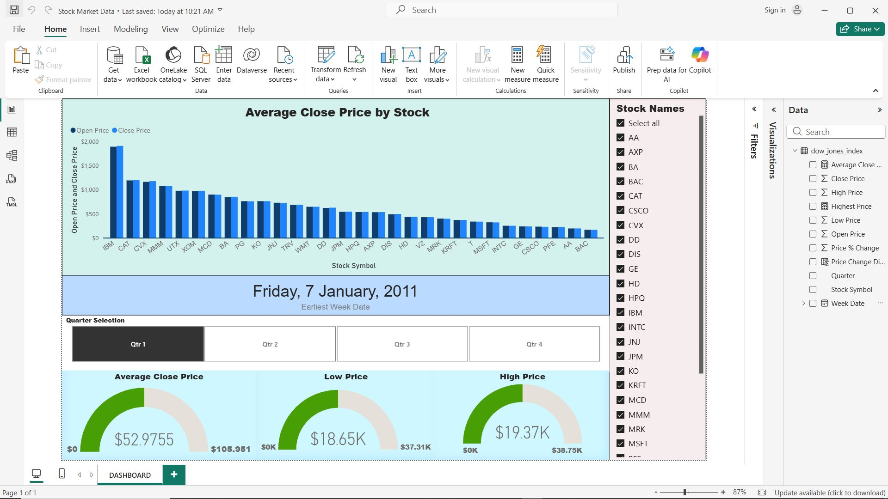

## Dashboard Preview

# Power BI Project 1(Fundamentals) - Dow Jones Stock Market Dashboard

This dashboard was developed as part of my early exploration of Power BI and data visualization.
The goal of the project was to understand how to import datasets, create interactive visuals, and build a basic analytical dashboard using the Dow Jones Index Dataset. The dashboard provides insights into stock price movements and price comparisons across multiple companies.

Key Features:
- Stock filtering
- Quarter filtering
- Price comparison visualization
- Price KPIs

Tools Used:
- Power BI
- Data visualization
- Financial Dataset Analysis

References 
- http://archive.ics.uci.edu/dataset/312/dow+jones+index
- https://www.indeed.com/career-advice/career-development/types-of-graphs-and-charts
